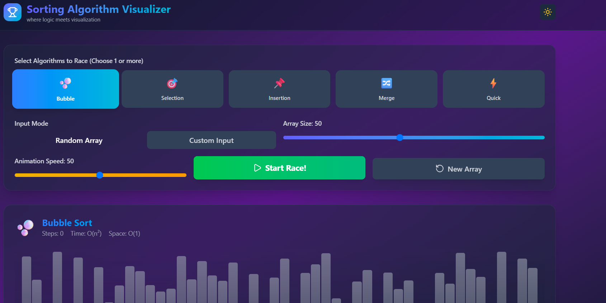
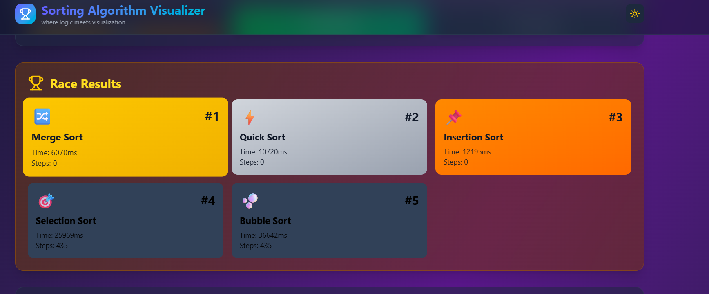

# 🚀 Sorting Algorithm Visualizer

An interactive and responsive web application that visualizes how different sorting algorithms work through real-time animations. This project helps users understand the internal workings of sorting algorithms by displaying each comparison and swap step by step.

---

## 📖 Overview

Sorting algorithms are fundamental concepts in computer science, but understanding how they work can be challenging through theory alone. This visualizer provides an intuitive way to learn by animating the sorting process, making it easier for students, beginners, and programming enthusiasts to grasp how algorithms behave.

---

## ✨ Features

* 🎯 Interactive visualization of sorting algorithms
* ⚡ Real-time sorting animations
* 📊 Random array generation
* 🎛️ Adjustable array size
* 🚀 Adjustable sorting speed
* 🎨 Clean and responsive user interface
* 📱 Works across different screen sizes

---

## 🧮 Algorithms Included

* Bubble Sort
* Selection Sort
* Insertion Sort
* Merge Sort
* Quick Sort

---

## 🛠️ Tech Stack

* **React.js**
* **Vite**
* **JavaScript (ES6+)**
* **HTML5**
* **CSS3**

---
# 📂 Project Structure

```text
Sorting-Algorithm-Visualizer
│
├── assets/
│   ├── mainpage.png
│   ├── racemode.gif
│   ├── Liveprogress.gif
│   ├── raceresult.png
│   └── react.svg
│
├── public/
├── src/
│   ├── assets/
│   ├── App.jsx
│   ├── main.jsx
│   └── index.css
│
├── package.json
├── vite.config.js
├── README.md
└── .gitignore
```


---

## 🚀 Getting Started

### Clone the repository

```bash
git clone https://github.com/student-Always-sn/Sorting-Algorithm-Visualizer.git
```

### Navigate to the project

```bash
cd Sorting-Algorithm-Visualizer
```

### Install dependencies

```bash
npm install
```

### Start the development server

```bash
npm run dev
```

Open the local development URL shown in the terminal (usually `http://localhost:5173`) to view the application.

---
# 📸 Demo

### 🎛️ Control Panel

Select one or more sorting algorithms, adjust array size, control animation speed, generate random arrays, or provide custom input before starting the visualization.



---
### 📊 Live Race Progress

Monitor the execution progress of every algorithm with real-time progress bars, completion status, and the currently leading algorithm.


---
### 🏆 Race Results

View the final ranking of sorting algorithms based on their execution time and overall performance after the race finishes.



---

## 🎯 Learning Outcomes

This project helped in understanding:

* Sorting algorithm concepts
* Algorithm visualization techniques
* React component architecture
* State management in React
* Event handling
* Performance comparison of sorting algorithms
* Frontend application development using React and Vite

---
# 📈 Time Complexity

| Algorithm | Best | Average | Worst | Space |
|-----------|------|---------|-------|-------|
| Bubble Sort | O(n) | O(n²) | O(n²) | O(1) |
| Selection Sort | O(n²) | O(n²) | O(n²) | O(1) |
| Insertion Sort | O(n) | O(n²) | O(n²) | O(1) |
| Merge Sort | O(n log n) | O(n log n) | O(n log n) | O(n) |
| Quick Sort | O(n log n) | O(n log n) | O(n²) | O(log n) |

---

## 🔮 Future Enhancements

* Add Heap Sort
* Add Radix Sort
* Add Shell Sort
* Sound effects during sorting
* Algorithm complexity comparison
* Execution time statistics
* Mobile UI improvements

---
## Live Demo: https://sorting-algorithm-visualizer-z6h8.vercel.app/

⭐ If you found this project helpful, consider giving it a star!
